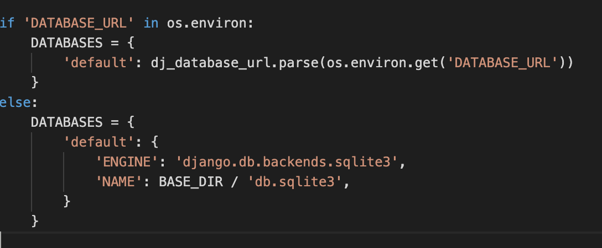

# Poster Art

Poster Art is an E-commerce business based around selling digital abstract art pieces printed at the highest quality once the order has been made.

Users can choose between a variety of different themed abstract art and what size they want to be printed, if they wish to frame it they can also purchase a frame.

My application features e-commerce functionality, payments using stripe, confirmation emails, CRUD functionality for admin to add blog posts and stock items, and an admin section, for the admin user to access database records.

* for the accessor I have included admin login details in the comment section when submitting the project.

* To test purchase products type 4242 4242 4242 4242

[>> View the live site here <<](https://rh-poster-art-ms4.herokuapp.com/)


## UX

Poster Art is a minimal design website where users can select and purchase from a range of abstract art prints so the main focus is to provide users with clear buttons directly to the prints page.

The main design of the website is black and white allowing the colours from the abstract art to shine through.

### User's goal

* View and purchase posters.
* Sort through by name, price etc.
* Easily navigate through the website.
* Visually pleasing.

### Site owners goal

* Allow users to sign up to the website.
* Add, Edit and Delete products.
* Search for products.

### User's Stories

**As a user visiting the website I want:**

* To be able to easily navigate the website.
* Create an account to store my shipping details.
* Logout.
* Sign in to my existing account.
* Search for posters.
* Purchase posters and frames.
* View new arrivals.

**As the website owner I want:**

* Users to easily be able to create an account.
* To be able to add new products.
* To edit existing products.
* To delete products.

### WireFrames

* [Poster Art - Home Page](static/images/wireframes/PosterArt-Home.png)
* [Poster Art - About Us Page](static/images/wireframes/PosterArt-About-Us-Page.png)
* [Poster Art - Posters Page](static/images/wireframes/PosterArt-Poster-Page.png)
* [Poster Art - Frames Page](static/images/wireframes/PosterArt-Frames-Page.png)
* [Poster Art - New Arrivals Page](static/images/wireframes/PosterArt-New-Arrivals-Page.png)
* [Poster Art - Sign Up Page](static/images/wireframes/PosterArt-signup-Page.png)
* [Poster Art - Login Page](static/images/wireframes/PosterArt-Login-Page.png)
* [Poster Art - Profile Page](static/images/wireframes/PosterArt-Profile-Page.png)
* [Poster Art - Cart Page](static/images/wireframes/PosterArt-cart-Page.png)
* [Poster Art - Checkout Page](static/images/wireframes/PosterArt-checkout-Page.png)

### Design Choices

**Fonts**

* All headers will be using the font Work Sans at size 900
* All paragraph, buttons & menu text will be using work sans at size 400

**Colours**

* The background will be white - #fffff
* All headers and buttons will be - #111111
* Paragraph text will be - #5B5B5B
* Menu text on home page - #fffff
* Menu text on other pages - #5B5B5B
* Promo Bar - #6D7F80
* Footer and secondary background colour - #D9D9D9

## Features

### Existing Features

* Feature 1 - A home app featuring a shop now banner taking you to the product page and a collect of the posters all linking to the specific poster designs.
* Feature 2 - A Products app displaying all products available which for super users can add and delete them.
* Feature 3 - A Profile app where logged in users can save there shipping address and view previous orders.
* Feature 4 - A login/signup app where users and login or create a new account if they dont have one already, A verification email will be sent.
* Feature 5 - A Bag app where users can view there product, size, quantity and amount.
* Feature 6 - A Checkout app where using can purchase there order.
* Feature 7 - A Blog app where users can view blog posts and comment when logged in, super users can add, edit and delete posts.
* Feature 8 - A Thank You section for after the users has purchased there order, displaying there order.
* Feature 9 - A About page giving info into the company.
* Feature 10 - Search Functionality
* Feature 11 - Pop up notification when any activity happens, reassuring users of any actions made within the website.

### Features Left to Implement

* If I had more time I wanted to add price change options depending on the product size.

## Technologies Used

* [HTML](https://en.wikipedia.org/wiki/HTML)
    * For Structuring the site.

* [CSS](https://en.wikipedia.org/wiki/CSS)
    * For Styling the Site.

* [JS](https://en.wikipedia.org/wiki/JavaScript)
    * For programming functions

* [Bootstrap](https://getbootstrap.com/)
    * For Grid Layout & Components.

* [Google Font](https://fonts.google.com/)
    * For selected font.

* [JQuery](https://jquery.com/)
    * Used for certain sections within the script.js file

* [Github](https://github.com/)
    * Storing project on.

* [Balsamiq](https://balsamiq.com/wireframes/?gclid=Cj0KCQiA3smABhCjARIsAKtrg6JfbE3I-05NWUBL17jlkE6uDkROXDoD5vXo7UJxVKIjsLVwujyaus0aAhAiEALw_wcB)
    * Creating wireframes on.

* [Google Chrome Developer Tool](https://developers.google.com/web/tools/chrome-devtools)
    * Checking site is responsive on multiple different devices.

* [Affinity Designer](https://affinity.serif.com/en-gb/designer/)
    * Creating Poster Art Logo

* [Flat Icon](https://www.flaticon.com/uicons)
    * Using the Icons

* [Heroku](https://dashboard.heroku.com/apps)
    * For Deployment

* [Amazon AWS](https://aws.amazon.com/?nc2=h_lg)
    * For Storing all media and static files

* [Django](https://www.djangoproject.com/)
    * Using its framework and app

* [Stripe](https://stripe.com/en-ie)
    * For payment system

## Testing

* Devices tested on:
    * Macbook Pro 13"
    * Lg 27" Monitor
    * iPhone 11
    * All devices in inspector tool.

* Browsers Tested on:
    * Google Chrome
    * Safari
    * Firefox

### User's Stories

* The navigation is clear at the top of the site with a navbar on mobile
* Login and sign up pages are available, users logged in can access there profile page with shipping details and order history
* You can logout when finished on the website.
* Search icon displayed and when clicked displays a full bar to search for a product.
* bag and checkout page is is available for users to purchase there order.
* New Arrivals displayed within the website.
* Blog can is showing the latest posts, users can comment on the post is they wish to.
* Super users can create, update and delete products.
* Super users can create, update and delete blogs.
* email verification then users log in.

### Manual Testing

1. Buttons
    * All links follow to the correct page.
    * Responds on all devices.

2. Links
    * All links follow to the correct page.
    * Burger Menu dislpayed on mobile view.
    * All products display in there correct category.

3. Search
    * Searching shows results from title and description.

    

4. Products
    * All product display in there correct category.

    

    * Product Ammount per page is displayed within the top left of the page.
    * Click the product takes you to the product in full detail where you can select the size and quantity.
    * Clicking add to cart send to bag and quanity amount is displayed on the bag icon.
    

5. Bag
    * Updating the quantity with increase the total price.
    

    * Bags under the price of €50 will be displayed with a text info on how much to spend for free shipping.
    

6. Checkout
    * Filling in the contact info and submiting without a correct email prompts a warning.
    

    * When for is correct we are sent to a thank you page with a success message.
    

7. Profile
    * Within profile users delivery information is saved and can be updated.
    
    * Order history is also displayed.

8. Pop Up
    * When products are added to the cart then a success message pops up.
    

9. Login/Register
    * Users can easily Login by providing there username and password.
    * User registering to the site provides email, username and password, If re enter email or password is incorrect and error is displayed.
    

    * When registered you will recieve a verification email to confirm you account.
    

10. Super Users
    * When a super users is logged in they recieve access to product managment and blog management.
    

    * within product management users can add a new product by filling in the form.
    

    * Clicking add, adds the products.
    

    * This works the same for posts.
    * within the product, super users can also edit and delete the product.
    

    * Clicking edit takes you to the form with the product info save in there.
    

    * Clicking delete removes product.
    

### Testing Code

* W3C Markup Validator
    * [Home](https://validator.w3.org/nu/?doc=https%3A%2F%2Frh-poster-art-ms4.herokuapp.com%2F)
    * [Products](https://validator.w3.org/nu/?doc=https%3A%2F%2Frh-poster-art-ms4.herokuapp.com%2Fproducts%2F)
    * [Blog](https://validator.w3.org/nu/?doc=https%3A%2F%2Frh-poster-art-ms4.herokuapp.com%2Fblog%2F)
    * [Profile](https://validator.w3.org/nu/?doc=https%3A%2F%2Frh-poster-art-ms4.herokuapp.com%2Fprofile%2F)
    * [Sign In](https://validator.w3.org/nu/?doc=https%3A%2F%2Frh-poster-art-ms4.herokuapp.com%2Faccounts%2Flogin%2F)
    * [Bag](https://validator.w3.org/nu/?doc=https%3A%2F%2Frh-poster-art-ms4.herokuapp.com%2Fbag%2F)
    * [Checkout](https://validator.w3.org/nu/?doc=https%3A%2F%2Frh-poster-art-ms4.herokuapp.com%2Fcheckout%2F)

* W3C CSS Validator


### Bugs Discovered

* Problem 1 - I wanted to change the price depending on the size, using this code worked but the price wouldnt carry over into the checkout page

```
// Help from Stackoverflow
var basePrice = +($('#price').html()).replace(/[^0-9\.]+/g,"");

$("#id_product_size").change(function() {
  newPrice = basePrice;
  $("#id_product_size option:selected").each(function() {
    newPrice += +$(this).attr('data-price');
  });
  $("#price").html('€' + newPrice.toFixed(2));
  var itemId = $(this).data('item_id');
  handleEnableDisable(itemId);
  console.log("Base Price", basePrice);
  console.log("New Price", newPrice);
});
```

* Problem 1 - Unfortunatley I didnt have enough time to solve it.

* Problem 2 - Within my sipping adress fields in model.py I had Eircode which sage didnt like and wouldnt let me complete purchase orders

* Problem 2 Solved - In order to fix this I had to remove eircode and customise my shipping address fields again.

## Deployment

**Heroku**

1. Create an account or login with heroku.
2. Once logged in select the new button to create a new app.
3. Enter your app name and the region closest to you and click create app
4. Within the resources tab, under Add-ons, type and select Heroku Postgres.
5. Select the free plan and click submit order form.
6. To use postgress we need to type the command " pip3 install dj_database_url" within the terminal.
7. You will also need to type "pip3 install psycopg2-binary" into the terminal.
8. Once you have entered the two commands above you will freeze them using "pip3 freeze > requirements.txt"
9. Then going into settings.py import dj_database_url
10. Whilst in setting.py, comment out the default DATABASES
11. Type in your own DATABASES and parse in your own Postgres which can be found in the setting tab by clicking the button "Reveal Config Vars on the Heroku website.
12. Use the command "python3 manage.py migrate" to migrate all changes.
13. In order to create database if you don't have fixtures use the command "python3 manage.py dumpdata --exclude auth.permission --exclude contenttypes > db.json" when connected to your mysql.
14. And then run the command "python3 manage.py loaddata db.json"
15. Once thats done, you will need to create a super user using the command "python3 manage.py createsuperuser"
16. Once superuser is created, go back to settings.py and remove our own created DATABASES and uncomment out the default one.
17. Within settings.py add and if statement like the image shown below.


18. Then install gunicorn by using the command "pip3 install gunicorn" which will act as our web server.
19. Again freeze the using "pip3 freeze > requirements.txt"
20. Now we can create our Procfile
21. Within Procfile add the code "web: gunicorn poster_art.wsgi:application"
22. You then need to login to heroku within the terminal using the command "heroku login -i" and enter your login details.
23. We then need to temporally disable-static files before deployment using the command "heroku config:set DISABLE_COLLECTSTATIC=1 --app poster-art-ms4"
24. Back in settings.py in ALLOWED_HOSTS add "'poster-art-ms4.herokuapp.com', 'localhost'.
25. To push to Heroku you will need to add and commit your changes and then use the commands "heroku git:remote -a poster-art-ms4" followed by "git push heroku master".
26. Once deployed we want it to automatically update once we commit, to do that go to deploy within the Heroku website search for your repository and click connect.
27. Now go to Django secret key generator and copy and paste it within config vars within the setting tab in Heroku with the name SECRET_KEY.

**Connect to Amazon AWS**

1. Start by heading to "https://aws.amazon.com/" and create an account.
2. Once you have created the account you can sign in under "My Account" > "AWS Management Console".
3. When you are logged in, select services and then s3.
4. When in s3 click on the button "Create bucket" and give it a name and select the region closest to you.
5. Directly below that under "Block Public Access settings for this bucket" make sure you have the "Block all public access" unchecked and acknowledge that the bucket will be public.
6. Once that is done then you can click "Create Bucket".
7. When your bucket is created, click on it and go into the properties tab and turn on Static website hosting and add the default values.
8. Now click into the Permissions tab and go down to cors configuration and paste in the code below.
9. Then you will go to "Bucket Policy", click "edit" and then click "policy generator".
10. Within there you want the policy type to be "s3 Bucket Policy", Principal to be "*" and the action to be "GetObject".
11. Now go back to the previous tab and copy your "Bucket ARN" and paste it within the ARN box to finish the form.
12. Click "Add Statement" then "Generate Policy" then copy the policy and paste it in the Bucket Policy Editor.
13. Before you save make sure you add a "/*" at the end of the resource key and click "save"
14. Finally, go to the "Access Control List", select "Edit" and tick the list within the "Everyone" section.

**IAM**

1. Start by searching for "IAM" within Amazon AWS.
2. When in the IAM Dashboard, click on "user groups" and then click the button "Create Group" and give it a suitable name and click "Create Group".
3. Now we can create the group used to access our bucket by going to "Policies" and the "Create policy".
4. Within in Create policy go into the JSON tab, select "import managed policy", search for s3, select "AmazonS3FullAccess" and click "import"
5. We don't want to allow all access, only to our specific bucket so get a copy of your bucker ARN back in s3 under "Permissions" > "Bucket Policy" > "Edit" and paste in like so.


6. Once that is done then click "Next" twice, within there you can give the policy a name and description and then click "Create policy".
7. Now go back to "User groups", select your created group, go to the "Permissions" tab, click "Add permissions", select "Attach Policies", pick the policy we just created and then click "Add permissions"
8. Next going to the "Users" page and click "Add users", create a username, give them "Programmatic access" and then select "Next".
9. Then pick you group you created, skip through to the end and click "Create user".
10. Now download the .csv file which will have the Access and Secret key displayed within it.

**Connecting Bucket to Django - Static Files**

1. Start by running "pip3 install boto3" within your terminal followed by "pip3 install django.storages".
2. Then you will freeze them using the command "pip3 freeze > requirements.txt".
3. Go back into settings.py and in "INSTALLED_APPS" add in the text "storages".
4. Also within settings.py under "MEDIA_ROOT" add in the code shown below.


5. Once that is done, go back to Heroku under the "Settings" tab in the "Config Vars" section and add in your access key and secret access key, these will be found within the .csv file you downloaded earlier. Also, add "USE_AWS" and set it to "True".
6. Also while in the Config Vars section remove "DISABLE_COLLECTSTATIC".
7. Back in settings.py in the same section, we were last on adding the code "AWS_S3_CUSTOM_DOMAIN = f'{AWS_STORAGE_BUCKET_NAME}.s3.amazonaws.com'"
8. Then you will create a new python file called "custome_storages.py", in there, add in the code like so.


9. Then go back into settings.py and add in this code under "bucket Config"


10. Once you have added then save, add, commit and push your changes.

**Media Files**

1. Head back to s3, select your desire account, click "Create folder", name the folder "media" and save.
2. Once created, go into your media folder and then click "Upload", add in all your images.  When all images are uploaded go down to permissions and select "Grant public-read access".
3. Now to confirm the superuser on the Postgres database we will need to login into Django admin, you can do this by adding "/admin" at the end of your website URL.
4. When logged in, go to emails, select your superuser email and go tick verified and primary.
5. ADD STRIPE KEYS AT THE END OR WHEN I FINISH THE STRIPE SECTION.

## Credits

### Content

* [This](https://www.youtube.com/watch?v=m3hhLE1KR5Q&list=PL8qSL3acJhtSnIyoGc4G2JK_nyvD5wypZ&index=1&ab_channel=CodeWithStein) was used to help me add the comments to the blog page.

### Media

* [Unsplash](https://unsplash.com/)
    * This was used for product images.

* [Pexels](https://www.pexels.com/)
    * This was used for product images.

* [Freepik](https://www.freepik.com/home)
    * This was used frame mockups.

### Acknowledgements

* Help from some students in the slack chat.
* I recieved help from the tutor support.
* Alot of help from the boutique ado lessons.